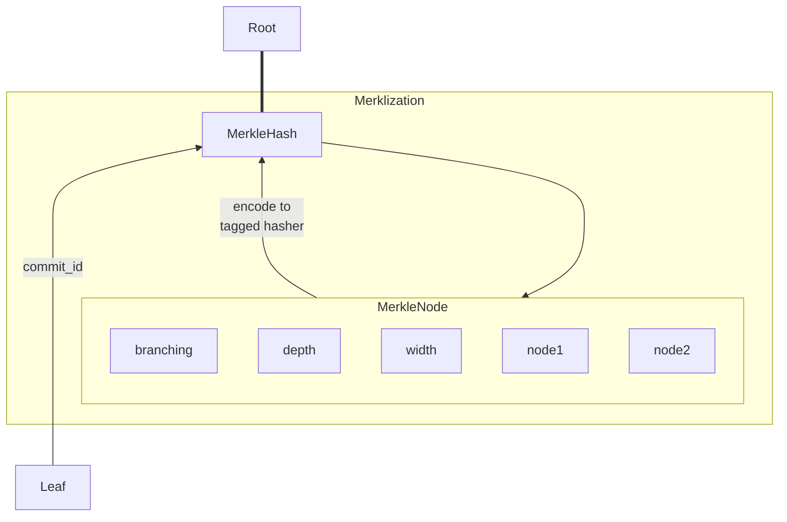
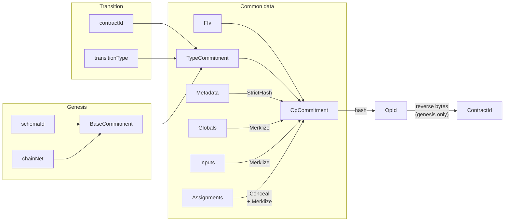
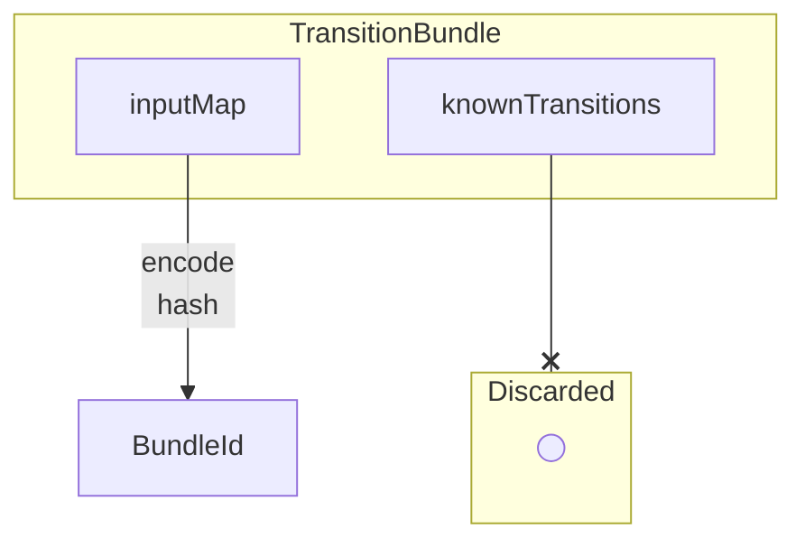

# RGB consensus commitments

RGB commits to client-side validated data using dedicated serialization
mechanism, implemented via `CommitEncode` trait. Depending on the specific data,
the mechanism can be partially or completely different from strict
serialization, used for data storage. For instance, all data which may be
confidential must be concealed, such that parties having no access to the
original non-confidential values are still able to generate the same
deterministic commitment value and verify single-use seals.

Any final consensus commitment is a SHA256 tagged hash. The tagging is performed
according to BIP-340, where a commitment-specific fixed ASCII string value is
first hashed with a single SHA256 hash, and the resulting 32 bytes are fed into
a new SHA256 hasher twice before any actual data.

## Generating commitment id

The commitment mechanism uses traits from [`commit_verify`] module in
`rgb-consensus`, specifically its `id.rs`and `merkle.rs` submodules.

### `CommitEncode` trait

It is the main trait which must be implemented for each type requiring a
dedicated commitment id.

The trait requires to define:
- `CommitmentId` specifies a commitment id type, i.e. a type wrapping 32-byte
  tagged SHA256 hash, implementing `CommitmentId` trait (see details below).
  For instance `Operation` defines `OpId` as its commitment type.
- `commit_encode` specifies an encoding for the bytestream that will be
  the input of the tagged hasher. Typical strategies are:
  * strict: the data is strict-serialized
  * conceal: the data is concealed and then strict-serialized
  * merkle: the data is organized in a merkle tree structure to obtain the merkle root

NB: It should never be necessary to call methods of `CommitEncode` trait directly,
since `CommitId` trait automatically extends it with user-facing methods.

### `CommitmentId` trait

Each consensus commitment must have a dedicated Rust type, which wraps over
inner `Bytes32` - a 32-byte resulting tagged hash value. The type is marked as
a consensus commitment by implementing `CommitmentId` trait for it, which
requires to provide a tag string value for the tagged hash.

The hash tags are defined using URN strings in form of
`urn:<org>:<protocol>:<data>#<date>`, where `<org>` stands for the organization,
`<protocol>` is the name of the protocol, `<data>` is the data type name
producing the commitment, and `<date>` is a `YYYY-MM-DD` string for the latest
revision of the commitment layout.

Any type implementing `CommitmentId` must also implement `From<Sha256>`, which allows for
automated construction of commitments from the hasher.

### `CommitId` trait

This trait is automatically implemented for all types thjat implement `CommitEncode` and
it can't be implemented manually.
It exposes a `CommitId::commit_id()` method to produce the final commitment (i.e. the result
of the hashing procedure, wrapped in the the corresponding type implementing `CommitmentId`).

The trait also provides `CommitId::commitment_layout()` method, which can be
used for automatically generating the documentation on the commitment workflow.

## Merklization procedure

Merlization is the procedure of computing the root of a
[Merkle Tree](glossary.md#merkle-tree) to be used as a commitment.
It uses traits and data types from `merkle.rs` module of `commit_verify` crate and it
commits to the tree parameters, such as number of elements, depth of the tree and
depth of each node.

The main data type, related to the merklization, is `MerkleHash`: it is a tagged
hash (using `urn:ubideco:merkle:node#2024-01-31` tag) representing node at any
position of the tree: leaves, branch nodes and merkle tree root. `MerkleHash`
can be produced in the following ways:
- as a result of merklziation procedure, when it represents Merkle tree root;
- as a root of empty Merkle tree (i.e. collection having 0 elements), by calling
  `MerkleHash::void(0u8, 0u32)`,
- as a Merkle leaf, by implementing `CommitEncode` on some type and setting
  commitment id to be `MerkleHash`.

In all of the above cases the hash commits to the tree parameters, which makes
it safe to use the same type for leaves, branches and root nodes. Specifically,
it uses an intermediate structure `MerkleNode`, which is filled with information
on:
- type of node branching (no branches, one branch or two branches),
- depth of the node, as 8-bit unsigned integer,
- width of the tree at its base, as a 256-bit LE unsigned integer,
- node hashes of the branches; if one or both branches are absent, they are
  replaced with 32 bytes of repeated 0xFF value.

A collection in form of a list (Rust `Vec`) or an ordered set of unique
non-repeating items (Rust `BTreeSet`), if wrapped into a confinement (i.e. has
type-defined bounds on the minimum or maximum number of items) can be
automatically merklized when passed as an argument to `MerkleHash::merklize()`
call. The API puts the following requirements on the collection: either
- maximum number of elements must be either 0xFF or 0xFFFF **and** each
  collection element must implement `CommitEncode` trait with target id set to
  `MerkleHash`,
- or there is a manual implementation of `MerkleLeaves` trait.

## Specific RGB consensus commitments

Currently, RGB has three consensus commitments: schema, operation and bundle.
Operation commitment for genesis has a second representation, named contract id,
which uses reversed-byte encoding and a special string serialization, but is
generated with the same procedure as the operation commitment.

The commitment ids can be generated with either type-specific methods
(`schema_id()` for schema, `bundle_id()` for state transition bundle and
`id()` for any operation) or the `CommitId::commit_id()` method, which must provide
the same result.

Here are more details on each commitment type:

| Commitment ID        | Produced by                          | Procedure                                                                                      | Tag URN suffix(1)             |
|----------------------|--------------------------------------|------------------------------------------------------------------------------------------------|-------------------------------|
| `SchemaID`           | `Schema`                             | strict serialization                                                                           | `rgb:schema#2024-02-03`       |
| `OpId`, `ContractId` | `Transition`, `Genesis`              | nested commitments with concealing, merklization etc via intermediate `OpCommitment` structure | `rgb:operation#2024-02-03`    |
| `BundleId`           | `TransitionBundle`                   | conceal and partial strict serialization                                                       | `rgb:bundle#2024-02-03`       |
| `SecretSeal`         | `BlindSeal`                          | conceal and strict serialization                                                               | `seals:secret#2024-02-03`     |

(1): "URN suffix" is the part that follows the "urn:lnp-bp:" prefix.

Additionally to these types there are three other commitment ids used internally
by merklization and strict encoding procedures:

| Commitment ID     | Tag URN suffix                                   |
|-------------------|--------------------------------------------------|
| `MerkleHash`      | `urn:ubideco:merkle:node#2024-01-31`             |
| `StrictHash`      | `urn:ubideco:strict-types:value-hash#2024-02-10` |
| `mpc::Commitment` | `urn:ubideco:mpc:commitment#2024-01-31`          |

`StrictHash` can be produced as a result of serialization of any
strict-encodable data; for instance, it is used in compactifying collections
into a single hash field in the process of computing operation ids (described
below).

Finally, in `commit_verify::mpc`, multi-protocol commitment
implementation, we have a type named `mpc::Commitment`, which is a commitment
to a root of the MPC tree (i.e. the tree's root `MerkleHash` is tag-hashed once
again to produce the final commitment value).

### Schema ID

Schema id, represented by `SchemaId` data type, is produced from `Schema` type
via strict serialization of all the schema data. No conceal or merklization
procedures are applied; i.e. the commitment id is the same as hashing serialized
schema with the given tag.

### Operation ID and Contract ID

Operation id is represented by a `OpId` type and produced for `Genesis` and
`Transition` types through a dedicated `OpCommitment` structure that is then
strict-serialized and hashed.

`OpCommitment` consists in a set of commitments to blocks of the operation data, each
generated with a specific procedure.

For instance, global state, inputs and assignments are merklized, such that compact
proofs of inclusion can be produced and used in smart contracts.
Additionally to that, assignments are concealed before the merklization, such that an
entity that does not know the blinding factor can still reproduce the same operation ID.
Other collections such as metadata are simply strict-serialized, producing a `StrictHash` as sub-commitment.

Additionally to `OpId`, genesis produces `ContractId`, which is made out of the
genesis `OpId` by reversing byte order and using Base58 encoding.

### Bundle ID

Bundle id is a unique identifier of state transition bundle, directly used in
constructing multi-protocol commitment tree. Bundle id commits to the mapping between
assignments spent within the bundle and the id of the operation spending them.
`TransitionBundle::known_transitions` may contain a subset of the transitions in the
bundle and thus it desn't contribute to the `BundleId`.

The procedure is explained in detail in a [dedicated chapter](../rgb-state-and-operations/state-transitions#transition-bundle)

