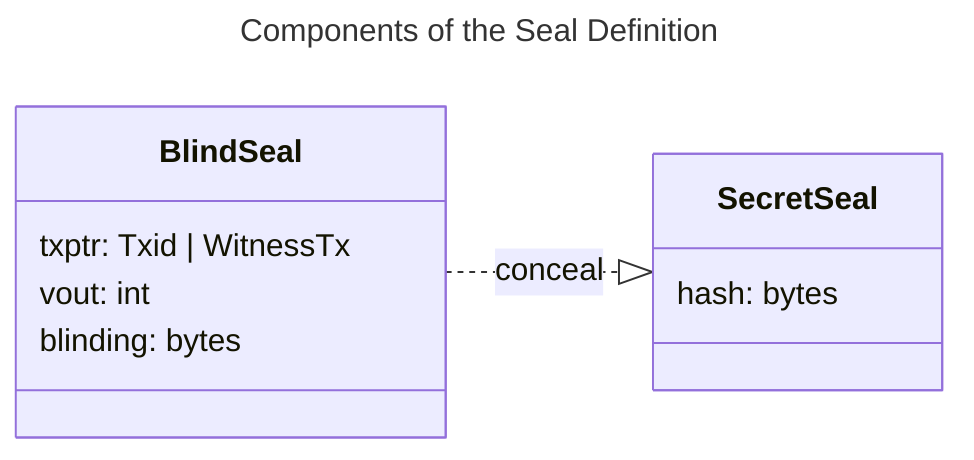

# Components of a Contract Operation

Let's now deep-dive into all the components of a contract operation, which are capable of changing the state of the contract and which are ultimately verified client-side by the legitimate recipient in a deterministic manner.


```
               +---------------------------------------------------------------------------------------------------------------------+
               |  Contract Operation                                                                                                 |
               |                                                                                 +-----------------------+           |
               |                                                                                 | ChainNet              |           |
               |  +-----+         +-----------------------+          +----------------+          | +-------+ +---------+ |           |
               |  | Ffv |         | ContractId | SchemaId |          | TransitionType |          | | Chain | | Network | |           |
               |  +-----+         +-----------------------+          +----------------+          | +-------+ +---------+ |           |
               |                                                                                 +-----------------------+           |
               |  +-----------------------------------------------+  +------------------------------------------------------------+  |
               |  | Metadata                                      |  | Global State                                               |  |
               |  |                                               |  | +----------------------------------+                       |  |
               |  | +-------------------------------------+       |  | | +-------------------+ +--------+ |                       |  |
               |  | |          Structured Data            |       |  | | |  GlobalStateType  | |  Data  | |     ...     ...       |  |
               |  | +-------------------------------------+       |  | | +-------------------+ +--------+ |                       |  |
               |  |                                               |  | +----------------------------------+                       |  |
               |  +-----------------------------------------------+  +------------------------------------------------------------+  |         +------+
               |                                                                                                                     +---------> OpId |
               |  +-----------------------------------------------+  +------------------------------------------------------------+  |         +------+
               |  | Inputs                                        |  | Assignments                                                |  |
               |  |                                               |  |                                                            |  |
               |  | +-------------------------------------------+ |  | +--------------------------------------------------------+ |  |
               |  | | Input #1                                  | |  | | Assignment #1                                          | |  |
+------+       |  | | +----------+ +----------------+ +-------+ | |  | | +----------------+ +-------------+ +-----------------+ | |  |       +--------------+
| OpId +--------------> PrevOpId | | AssignmentType | | Index | | |  | | | AssignmentType | | Owned State | | Seal Definition +--------------> Bitcoin UTXO |
+------+       |  | | +----------+ + ---------------+ +-------+ | |  | | +----------------+ +-------------+ +-----------------+ | |  |       +--------------+
               |  | +-------------------------------------------+ |  | +--------------------------------------------------------+ |  |
               |  |                                               |  |                                                            |  |
               |  | +-------------------------------------------+ |  | +--------------------------------------------------------+ |  |
               |  | | Input #2                                  | |  | | Assignment #2                                          | |  |
+------+       |  | | +----------+ +----------------+ +-------+ | |  | | +----------------+ +-------------+ +-----------------+ | |  |       +--------------+
| OpId +--------------> PrevOpId | | AssignmentType | | Index | | |  | | | AssignmentType | | Owned State | | Seal Definition +--------------> Bitcoin UTXO |
+------+       |  | | +----------+ +----------------+ +-------+ | |  | | +----------------+ +-------------+ +-----------------+ | |  |       +--------------+
               |  | +-------------------------------------------+ |  | +--------------------------------------------------------+ |  |
               |  |                                               |  |                                                            |  |
               |  |       ...           ...          ...          |  |     ...          ...             ...                       |  |
               |  |                                               |  |                                                            |  |
               |  +-----------------------------------------------+  +------------------------------------------------------------+  |
               |                                                                                                                     |
               +---------------------------------------------------------------------------------------------------------------------+
```


With the help of the comprehensive diagram above, it's important to point out that any contract operation is composed of some components related to the **New State** and some components that reference the **Old State** being updated.

The **Old State** is referenced through [Inputs](components-of-a-contract-operation.md#inputs), which point towards previous assignments of related State Transitions and are not found in Genesis.

The **New state** is represented by:
* **Assignments**, which are composed by:
  * [Seal Definition](components-of-a-contract-operation.md#seal-definition).
  * [Owned State](components-of-a-contract-operation.md#owned-states).
* [Global State](components-of-a-contract-operation.md#global-state), which can be either [mutated or added](components-of-a-contract-operation.md#state-update-methods-and-rules).
* [Metadata](components-of-a-contract-operation.md#metadata), which are only available locally to the current operation.

In addition, we also have several operation-specific fields:

* `Ffv` or `Fast-forward version` a 2-byte integer indicating the version of the contract, following the RGB rules of [fast-forward versioning](features-of-rgb-state.md#rgb-consensus-changes). The version of the contract can be updated according to the issuer's choices and needs at certain points in the contract's history, such as concerning _re-issuances._
* `TransitionType` a 16-bit integer indicating the type of Transition expressed by the operation encoded in the Contract [Schema](../annexes/glossary.md#schema) and representing the manifestation of the [Business Logic](../annexes/glossary.md#business-logic) of the contract. It's not present in [Genesis](../annexes/glossary.md#genesis).
* `ContractId` the 32-byte number that references the `OpId` of the Genesis of the contract. Naturally, it's only present in State Transitions, but not in Genesis.
* `SchemaId` is a field found only in Genesis, instead of the `ContractId`. It's a 32-byte hash of the contract [Schema](../annexes/glossary.md#schema) used in the contract.
* `Testnet` is a boolean variable indicating the use of Bitcoin Testnet or Mainnet. It is only present in Genesis.
* `ChainNet` is an object that describes the context in which the contract should operate; it is composed by `Chain` (e.g. Bitcoin, [Liquid](https://blockstream.com/liquid/)) and `Network` (e.g. `Mainnet`, `Testenet`). It is only present in Genesis.
* `Metadata` that allows you to declare temporary variables that are useful for validating complex contracts, but that do not have to be recorded as [state](../annexes/glossary.md#contract-state) properties.

Finally, through a custom hashing methodology, all of the fields in the Contract Operation are summarized into an `OpId` commitment that is placed in the [Transition Bundle](state-transitions.md#transition-bundle).

We will cover each contract component in a dedicated subsection. The complete memory layout of each component of a contract operation is given [here](https://github.com/RGB-WG/rgb-core/blob/v0.11.1-alpha.2/stl/Transition.vesper).

## OpId

Each Contract Operation is identified by a 32-byte hash called `OpId`, which is, precisely, the ordered SHA-256 hashing of the element contained in the State Transition. Each [Contract Operation](../annexes/glossary.md#contract-operation) has its own customized [commitment and hashing methodology](https://github.com/RGB-WG/rgb-core/blob/vesper/doc/Commitments.md#operation-id-and-contract-id).

## ContractId

As an important additional feature, the `ContractId` of a smart contract is calculated by using the `OpId` of its [Genesis](../annexes/glossary.md#genesis) and applying to it a _Reverse byte order operation_ plus a [Base58](https://en.wikipedia.org/wiki/Binary-to-text\_encoding#Base58) encoding.

## Contract State

Before addressing each state component, it's essential to clarify through which elements a [Contract State](../annexes/glossary.md#contract-state) is expressed in the RGB protocol. Specifically, in RGB, the **State** of a contract is fully expressed by:

* A single **Global State**
* One or more **Owned State(s)** that are controlled by some contract participants

Global States are embedded into Contract Operation as a single component block, while [Owned States](../annexes/glossary.md#owned-state) are defined inside the [Assignment](../annexes/glossary.md#assignment) construct where they are stored alongside the pertaining [Seal Definition](../annexes/glossary.md#seal-definition).

### State update methods and rules

An important feature of RGB, which **affects both Global and Owned States, is the way the state is modified**. Basically, States may exhibit two different behaviors:

* A **Mutable** behavior, in which **each state transition discards the previous state** and assigns a new one.
* An **Accumulating** behavior, in which each state transition adds a new state to the previous state.

In all cases where the **Contract State is neither Mutated nor Accumulated, the respective components are left empty**, meaning that no repetition of data takes place in a Contract Operation.

The choice between mutable or accumulated state is set inside the [Business Logic](../annexes/glossary.md#business-logic) encoded in the [Schema](../annexes/glossary.md#schema) of the contract and cannot be changed after the Genesis.

The table below provides a summary of the rules regarding the permitted modification of Global/Owned States by each Contract Operation, if allowed by contract schema:

|                          | **Genesis** | **State Transition** |
| ------------------------ | :---------: | :------------------: |
| **Adds Global State**    |      ✓      |           ✓          |
| **Mutates Global State** |      ✗      |           ✓          |
| **Adds Owned State**     |      ✓      |           ✓          |
| **Mutates Owned State**  |      ✗      |           ✓          |

As a final consideration of this section, in the following table we provide a summary of the main scope-related properties that the various kind of state data elements exhibit in the RGB protocol.

|                    |             **Metadata**            |                   **Global state**                  |                                             **Owned state**                                            |
| ------------------ | :---------------------------------: | :-------------------------------------------------: | :----------------------------------------------------------------------------------------------------: |
| **Scope**          |    Defined per contract operation   |            Defined per contract globally            |                                Defined per single-use-seal (Assignment)                                |
| **Who can update** |            Not updatable            |                  Operation creators                 |                   Controlled by right owners (parties able to close single-use-seal)                   |
| **Time scope**     | Defined just for a single operation | State is defined after/as a result of the operation | State is defined before the operation (when the seal definition is embedded in the previous operation) |

### Global State

The purpose of Global State can be summarized by the following sentence:**"nobody owns, everyone knows"** in that it defines certain general features of the contract that must be publicly visible. A **Global State is always a public state**, and can be written in Genesis by the [contract issuer](../annexes/glossary.md#contract-participant) and later modified in state transition by a legitimate party defined in the contract schema.

The Global State is usually made available by contract issuers or contract participants and distributed through both centralized and decentralized public networks (e.g. websites, IPFS, Nostr, Torrent, etc.) in form of a [contract consignment](../annexes/glossary.md#consignment). It's important to note that the **availability** of the Global State is incentivized only by economic means of using and sharing the contract to the wider public: the parties involved are committed to bear the cost of the necessary storage solution that enables the accessibility of this kind of contract data.

Each component of a Global State consists of a 2-field structure that includes:

* A `GlobalType` which embeds a deterministic reference to the global propriety expressed in the [Schema](../rgb-contract-implementation/schema/).
* The actual Data expressing the property.

For example, the Global State of a newly issued [Non Inflatable Asset](../rgb-contract-implementation/schema/non-inflatable-fungible-asset-schema.md), which is encoded in the Genesis, contains:

* The `ticker`.
* The full name of the token: `name`.
* The precision of decimal digits: `precision`.
* The issued supply of the token: `issuedSupply`.
* A text with some legal disclaimer: `terms`.

### Assignments

Assignments are the core constructs responsible for the [Seal Definition](../annexes/glossary.md#seal-definition) operation and related [Owned State](../annexes/glossary.md#owned-state) to which that Seal Definition is bound. They are the central part that enables the **rightful transfer of a digital property**, described in the Owned State, to a New Owner identified by the possession of a specific Bitcoin [UTXO](../annexes/glossary.md#utxo). An Assignment can be compared to a Bitcoin Transaction Output, but possibly embedding more expressiveness and potential.

Each Assignment consists of the following components:

* The `AssignmentType` which is the identifier of the digital property that is stored in the Assignment (e.g. `assetOwner`, which identifies a token allocation with its amount).
* The `Seal Definition` which is a sub-construct containing the reference to the UTXO.
* The `Owned State` which specifies how the properties associated with the `AssignmentType` are modified.

#### Seal Definition

The first main component of the Assignment construct is the [Seal Definition](https://github.com/RGB-WG/rgb-core/blob/master/src/contract/seal.rs) which points to the new owner of the allocation in the form of `txptr`, `vout` and `blinding`.

* `txptr` is a more complex object than a simple hash of a Bitcoin Transaction. In particular, it can have two distinct kinds:
  * `Txid`: a regular bitcoin transaction identifier
  * `WitnessTx`: "self", a special value that allows to reference the [witness transaction](../annexes/glossary.md#witness-transaction) for the current transfer. This is required because the anchor contributes to the txid, leading to a circular dependency

  The `WitnessTx` value only applies to operations that have a witness transaction, which is not always the case. So we have different names for seals depending on whether it's allowed:
  * `Genesis seal`, created by [Genesis](../annexes/glossary.md#genesis), always needs to point to an existing `txid` since there is no witness transaction.
  * `Graph seal`, in which both kinds are supported:
    * `Txid`, which leads to what we call a "blinded transfer"
    * `WitnessTx`, that results in a so-called "witness transfer". This is useful for instance in Lighting channel updates and when the recipient doesn't have any available UTXOs.
* `vout` is the transaction output number within the Transaction which `txptr` refers to. The `txptr`  field together with `vout` field constitute an extension of the standard _outpoint_ representation of Bitcoin transactions.
* `blinding` is a random number of 8 bytes, which allows the seal data to be effectively hidden once they have been hashed, providing privacy to the recipient at least until the allocation is later spent again.

The `concealed` form of the Seal Definition is simply the SHA-256 [tagged hash](https://github.com/RGB-WG/rgb-core/blob/vesper/doc/Commitments.md#specific-rgb-consensus-commitments) of the concatenation of the four fields:

`SHA-256(SHA-256(seal_tag) || SHA-256(seal_tag) || txptr || vout || blinding)`

Where:

* `seal_tag = urn:lnp-bp:seals:secret#2024-02-03`


*Notes:*
- A `BlindSeal` in which `TxPtr` is bound to be a `Txid` is called `GenesisSeal`
- A `BlindSeal` in which `TxPtr` can be either a `Txid` or the special value `WitnessTx` is called `GraphSeal`

#### Owned States

This second Assignment component is responsible for defining and storing the data assigned by the Seal Definition. Before proceeding with the features of Owned States, a brief digression about `Conceal/Reveal` feature of this construct is necessary. Unlike the Global State, Owned States come in two forms:

* **Public** Owned States: in which related data must always be kept and transferred in a revealed form by their owner recursively. For example, they may apply to some image files that must be bound to ownership, but are always publicly shown. This form can be described by the phrase: **"someone owns, everybody knows"**.
* **Private** Owned States: in which related data is kept hidden and revealed only if it is part of the history for validation purposes. For example, the number of tokens transferred in a token contract is generally kept private. This form can be summarized by the sentence: **"someone owns, nobody knows"**.

In RGB, an Owned State can only be defined with one of the three **StateTypes**: `Declarative`, `Fungible`, `Structured`:

* `Declarative` is a StateType with **no data**, representing some form of governance [rights](../annexes/glossary.md#contract-rights) that can be performed by a contract party. For example, it can be used for _voting rights_.
* `Fungible` is the StateType that allows for the transfer of **fungible units** such as those in a token contract; it consists of a single `amount` field.
* `Structured` is a State Type that can accommodate ordered and limited data collections of arbitrary content, which can be used as input for complex contract validation schemes. Its maximum storage size is limited to a maximum of 64 KiB.

The diagram below shows a summary of the three state types with their content:


```
  State                 Content

+---------------------------------------

                     +---------------+
                     |               |
  Declarative        |   < void >    |
                     |               |
                     +---------------+

+---------------------------------------

                     +---------------+
                     | +-----------+ |
  Fungible           | |   Amount  | |
                     | +-----------+ |
                     +---------------+

+-------------------------------------

                     +---------------+
                     | +-----------+ |
  Structured         | | Data Blob | |
                     | +-----------+ |
                     +---------------+
```


In addition, a summary of the technical characteristics of each **StateType** is provided in the table below:

<table>
  <thead>
    <tr><th width="164">Item</th><th width="136">Declarative</th><th width="132">Fungible</th><th>Structured</th></tr>
  </thead>
  <tbody>
    <tr><td><strong>Data</strong></td><td>None</td><td>64-bit signed/unsigned integer</td><td>Any strict data type</td></tr>
    <tr><td><strong>Type info</strong></td><td>None</td><td>Signed/unsigned</td><td>Strict Types</td></tr>
    <tr><td><strong>Size limits</strong></td><td>N/A</td><td>256 Byte</td><td>Up to 64 kByte</td></tr>
  </tbody>
</table>

## Inputs

Similar to Bitcoin Transactions, **Inputs represent the "other half" of the Assignment construct**. They have the basic role of referencing Assignments from a previous State Transition or Genesis. Inputs are not present in Genesis and consist of the following fields:

* `PrevOpId` containing the identifier of the previous Assignment operation being referenced.
* `AssignmentType` containing the identifier of the contract property being modified by the referenced Assignment.
* `Index` is the index number of the Assignment being referenced within the Assignment list of the `PrevOpId`. The `Index` is calculated implicitly from the lexicographic sorting of the hashes of the **Concealed Seal** of the referenced Assignments.

The validation procedure of RGB, in addition to checking the correct closure of the Seal, is also responsible for checking the consistency between the inputs and outputs, particularly for the `Fungible` StateType. In this case, the validation procedure, embedded in the [AluVM](../annexes/glossary.md#aluvm) script part of the [Schema](../annexes/glossary.md#schema), checks that the amount of tokens of each Input of a specific `AssignmentType` matches the number of tokens of the Assignments with the same `AssignmentType`.

As a natural property, Genesis has no Inputs as well as all State Transitions that don't change some Owned States of any kind. For example, a State Transition that changes only the Global State has no Inputs.

## Metadata

The metadata construct is a particular field that contains all the information that is not useful to be stored as part of the contract state history. It has a maximum size of 64 KiB and can be used, for example, to host temporary data from a complex contract validation procedure by the AluVm engine.

***
