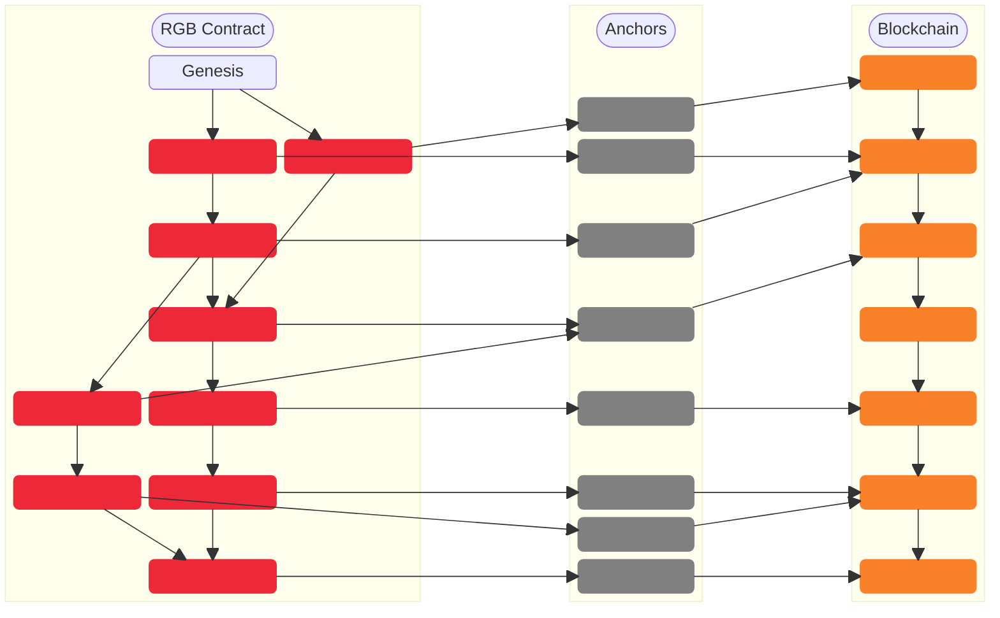

# Contract Operations

## State Transitions and their mechanics

The approach followed in this paragraph is the same as that developed in the [TxO2 Client-side Validation chapter](../commitment-layer/commitment-schemes.md#txo2-client-side-validation) using our beloved cryptographic characters Alice and Bob.

This time the explanation **contains an important difference**: Bob is not simply validating the client-side validated data that Alice shows him. He is actually asking Alice to add some additional data that **will give Bob some degree of ownership** over the contract expressed as a hidden reference to one of his Bitcoin [UTXOs](../annexes/glossary.md#utxo). Let's see how the process works in practice for a [State Transition](../annexes/glossary.md#state-transition) (one of the fundamental [Contract Operations](../annexes/glossary.md#contract-operation)):

1. Alice has a [stash](../annexes/glossary.md#stash) of client-side validated data, which references a Bitcoin UTXO owned by her. This means that in her client-side validated data there is a [seal definition](../annexes/glossary.md#seal-definition) that points to one of her UTXOs.

<figure><figcaption><p>At the beginning of the State Transition, Alice possesses a certain stash and a UTXO. The idea behind the operation is that she will pass some digital rights in her possession to Bob.</p></figcaption></figure>

2. Bob, in turn, also has unspent UTXOs. These UTXOs are completely unrelated to Alice's, which means that there is no direct spending event that creates a link between them. **If Bob doesn't possess any UTXO it is also possible to spend towards him the witness transaction** output containing the commitment to the client-side data and implicitly associate the ownership of the contract to him.

<figure><figcaption><p><strong>Bob also owns some UTXOs. Moreover, they are unrelated to Alice's. This UTXO is an important, yet not mandatory, requirement to complete the State Transition. In case Bob doesn't possess any UTXO, it's also possible to spend the witness transaction towards him implicitly associating the new ownership to this new output.</strong></p></figcaption></figure>

3. Bob, through some informational data, encoded in an [invoice](../annexes/glossary.md#invoice), instructs Alice to create a **New state** that follows the rules of the contract and which embeds a **new seal definition** pointing to one of his UTXOs in a concealed form (more on that [later](components-of-a-contract-operation.md#revealed-concealed-form)). In this way, Alice assigns Bob **some ownership** of the new state: for example, ownership of a certain amount of tokens.

<figure><figcaption><p><strong>Bob shares with Alice the necessary data to build the State Transition that assigns him some new state.</strong></p></figcaption></figure>

4. After that, Alice, using some [PSBT](../annexes/glossary.md#partially-signed-bitcoin-transaction-psbt) wallet tool, prepares a transaction that spends the UTXO that was indicated by the previous seal definition (the very same one that granted her ownership of some elements of the contracts). In this transaction, which is a [witness transaction](../annexes/glossary.md#witness-transaction), Alice embeds in one output a commitment to the new state data that uses [Opret](../commitment-layer/deterministic-bitcoin-commitments-dbc/opret.md) or [Tapret](../commitment-layer/deterministic-bitcoin-commitments-dbc/tapret.md) rules depending on the chosen method. As explained earlier, Opret or Tapret commitments are derived from an [MPC](../annexes/glossary.md#multi-protocol-commitment-mpc) tree which may collect more than one contract's state transition.
5. Before transmitting the transaction thus prepared, Alice passes to Bob a data packet called [Consignment](state-transitions.md) which contains the organized stash of client-side data already in possession of Alice in addition to the new state. Bob, at this point, using RGB consensus rules:
   * **Validates every RGB state transition** in the Consignment, including the one creating some New State assigned to his own UTXO.
   * **Verifies** that every RGB state transition **is committed to in a valid [witness transaction](../annexes/glossary.md#witness-transaction)**, ensuring **legitimacy** and **uniqueness** of the whole history from Genesis to the new state.
6. After checking the correctness of the Consignment, Bob may optionally give Alice a "go-ahead" signal (e.g., by GPG signing the [consignment](../annexes/glossary.md#consignment)).  Alice, even without Bob's clearance, can now broadcast this last witness transaction, containing the New State. Once confirmed, such a witness transaction represents the conclusion of the [State Transition](../annexes/glossary.md#state-transition) from Alice to Bob.

For the detailed process of a contract transfer with the RGB stack, see the [related section](../annexes/contract-transfers.md).

<figure><figcaption><p>T<strong>he new state points to Bob's UTXO by assigning him the digital property once in Alice's possession. The new state is committed in the witness transaction that spends the UTXO, which in turn proves Alice's ownership over the digital property that is passed over to Bob. The spending of the UTXO by Alice marks the completion of the State Transition embedding the same level of anti double-spending security as in Bitcoin.</strong></p></figcaption></figure>

It's useful to see the full details of a DAG of two RGB contract operations - ([Genesis](../annexes/glossary.md#genesis) + a [State Transition](../annexes/glossary.md#state-transition)) - both from the RGB client-side components, which will be covered in the next few paragraphs, and from the _connection points_ to the Bitcoin Blockchain which embeds the seal definition and the witness transaction.

![A representation of RGB Laver (red) and Bitcoin Commitment Layer (orange) and their respective connections during contract operations. The diagram shows the combination of two contract operations: a Genesis, constructing a Seal Definition, and a State Transition which closes the seal previously defined in the Genesis and defines a new seal (new ownership) within another Bitcoin UTXO.  The State Transition Bundle is meant to collect more than one State Transition in case multiple seals are closed in the same witness transaction.](../.gitbook/assets/state-transition-2-detail.png)

Just to give an introduction to the context of the above diagram, let us introduce terminology that will be discussed [later](components-of-a-contract-operation.md) in greater technical detail:

* The [Assignment](../annexes/glossary.md#assignment) construct, which is pointed at Alice (in this example by the Genesis), and later used by Alice and pointed at Bob, is responsible for two things:
  * The [Seal Definition](../annexes/glossary.md#seal-definition) which points to a specific UTXO (to Alice's first, by the Genesis created by a contract issuer, and later to Bob's by Alice herself).
  * The association of the Seal Definition to specific sets of data called [Owned States](../annexes/glossary.md#owned-state) which, depending on the properties of the contract, can be chosen from several types. To give a simple context example, the amount of tokens transferred is a common kind of Owned State.
* [Global State](../annexes/glossary.md#global-state), on the other hand, reflects general and **public properties** of a contract that are not meant to be owned, such as the total issued supply for a inflatable fungible asset.

As mentioned [earlier](intro-smart-contract-states.md#introduction-to-states), a State Transition represents the main form within [Contract Operations](../annexes/glossary.md#contract-operation) (in addition to [Genesis](../annexes/glossary.md#genesis)). **State Transitions** refer to one or more previously defined state(s) - in Genesis or another State Transition - and update them to a **New State**.&#x20;


As an interesting scalability feature of RGB, multiple **State Transitions** can be aggregated in a **Transition Bundle**, so that **each bundling operation** fits one and only one contract leaf in the [MPC](../annexes/glossary.md#multi-protocol-commitment-mpc) tree:

* A [Transition Bundle](state-transitions.md#transition-bundle) collects all transitions that refer to a given contract.
* The Transition Bundle is hashed to produce its [BundleId](state-transitions.md#bundleid), which is included in a leaf of the [MPC](../annexes/glossary.md#multi-protocol-commitment-mpc) Tree at a position that is determined by its contract ID.
* When all bundles are included in the tree, the empty leaves are filled with random data and its merkle root is computed. The MPC commitment, composed by the merkle root and parameters used in the tree construction, is finally included into a Tapret or Opret output thanks to [DBC](../annexes/glossary.md#deterministic-bitcoin-commitment-dbc), so that the bitcoin transaction unequivocally commits to a set of RGB state transitions.
* The [Anchor](../commitment-layer/anchors.md) represents the _connection point_ between the Bitcoin Blockchain and the RGB client-side validation structure.

In the following paragraphs, we will delve into all the elements and processes involved in the State Transition operation. All topics discussed from now on belong to RGB Consensus, which is encoded in the [RGB Core Library](../annexes/rgb-library-map.md#rgb-core).

## Transition Bundle

A transition bundle is essentially the collection of all state transitions in a given witness transaction that operate on a certain contract. **In the simplest case, such as the one shown above between Alice and Bob, a Transition Bundle consists of a single state transition**.

However, RGB natively supports batching operations, so that one or more payers can send assets to one or more payees and multiple transition types and state types are involved (e.g. atomically sending tokens and inflation rights). In these cases, all the operations involving a certain contract would belong to the same position in the MPC tree, so they need to be deterministically bundled in order to fit in a single MPC leaf. The corresponding [witness transaction](../annexes/glossary.md#witness-transaction) then needs to close all the seals that are spent by each state transition.

### BundleId

From a more technical angle, the `BundleId` to be inserted in the leaf of the [MPC](state-transitions.md) is [obtained](https://github.com/RGB-WG/rgb-core/blob/vesper/doc/Commitments.md#bundle-id) from a tagged hash of the strict serialization of the `InputMap` field of the bundle in the following way:

`BundleId = SHA-256(SHA-256(bundle_tag) || SHA-256(bundle_tag) || InputMap)`

Where:

* `bundle_tag = urn:lnp-bp:rgb:bundle#2024-02-03`

The `InputMap` associates `N` inputs of the witness transaction (by their vin) to the set of `K_N` RGB transitions that involve state that used to be linked to the spent outpoints and it gets serialized in the following way:

```
InputMap =

     N        input_0      K_0      OpId_0(input_0)   OpId_1(input_0)        input_1     K_1      OpId_0(input_1)   OpId_1(input_1)
            |_________||_________||________________||________________| ... |_________||_________||________________||________________| ...
             32-bit LE  16-bit LE     32-byte hash      32-byte hash        32-bit LE 16-bit LE     32-byte hash      32-byte hash
|__________||_____________________________________________________________||______________________________________________________________|  ...
 16-bit LE                               MapElement0                                            MapElement1
```

Where:

* `N` is the total number of inputs of the **witness transaction** that refer to some `OpId`s.
* `OpId_i(input_j)` is the Operation Identifier of the `i`-th State Transition that spends some state associated with the `j`-th input of the witness transaction.

**Note:** In general, there is a many-to-many relationship between witness transaction
inputs and the transitions. This for instance allows to:
- use allocations from two different UTXOs as inputs to the same state transition, e.g.:
    - Alice owns 10 assets on `utxo_1` plus 5 assets on `utxo_2` and wants to send 12 assets to Bob
    - The input map will look like: `{utxo_1: {opid_1}, utxo_2: {opid_1}}`
- use different transitions to move more than one allocation on a given UTXO
    - Alice owns both assets and an inflation right on `utxo_1` and wants to spend it without burning anything
    - The input map will look like: `{utxo_1: {opid_1, opid_2}}`

To prevent double spends, client-side validation thus needs to check that every allocation only appears **once** in state transition inputs.

## State Generation and Active State

State transitions, just covered in the previous sections, allow the transfer of ownership of certain state properties from one party to another. However, state transitions are only one of the [Contract Operations](../annexes/glossary.md#contract-operation) allowed in RGB. The other one, which allows to generate new state at the issuance of a contract, is called **Genesis**.

The following figure shows the three components of contract operations along with their position in the RGB contract DAG, linked to their respective anchors in the Bitcoin Blockchain. State Transitions are represented by the red blocks.


It is important to note that the main difference between ordinary State Transitions and Genesis lies in the **lack of the closing part of the seal**. Hence **Genesis, in order to appear into the blockchain history, requires a State Transition that closes one of the seals defined by it**.

Another obvious, but crucial, aspect to keep in mind is that the **Active State(s)** are the last state(s) at the leaves of the [DAG](state-transitions.md) of contract operations that reference themselves in the order committed into the Bitcoin Blockchain, starting from the Genesis. All other states associated with spent UTXOs are no longer valid but are critical to the validation process.

### Genesis

Genesis represents the **initial data block of each RGB contract.** It is constructed by a [contract issuer](../annexes/glossary.md#contract-participant) and any state transitions must be connected to it through the DAG of the contract operations.\
In Genesis, according to the rules defined in the [Schema](../annexes/glossary.md#schema), are defined several properties affecting deeply the contract states, both of [owned](../annexes/glossary.md#owned-state) and [global](../annexes/glossary.md#global-state) form.

To give an example, in the case of a contract defining the creation of a token, the following data are likely to be inscribed in Genesis:

* The number of tokens issued and their owner(s) (the owner(s) of the UTXO referred to in the seal definition's genesis).
* The maximum number of tokens to be issued in total.
* The possibility of inflation and the designed party that possesses this right.

As a natural implication, **Genesis does not refer to any previous state transition**, nor does it close any previously defined seal. As mentioned above, to be effectively validated in the history of the chain, a Genesis must be referenced by a first state transition (e.g. an auto-spend to the issuer or a first round of distribution), which finalizes the "first ownership" of the contract through a commitment to the Bitcoin Blockchain.

***
